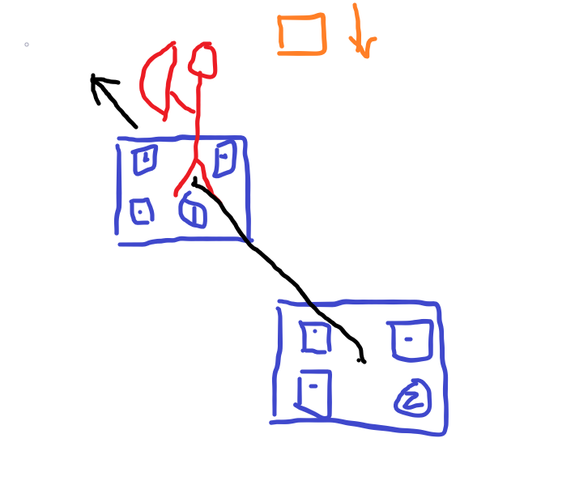
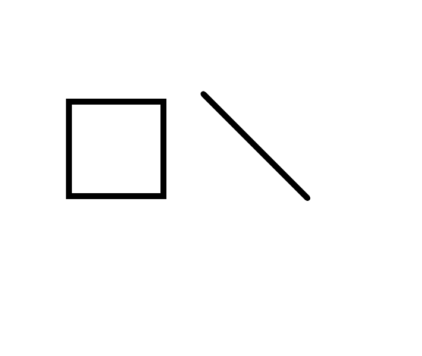

# Outline of final project

## 1. assignment

野田 遼平					video edit and slide

栃本 拓海					modeling

YE ZHUOBIN			  coding

TSAI CHANCHANG	application designing, presentation and something else(help coding, etc.)

## 2. description of the application 

​	In this application, we will control a man who is holding a bow, and control him to shot the item dropping from the top of the screen. If our arrow hit the item, both item and arrow will disappeare and score will plus 1.

​	This is a simple top down TPS game.

### control method

​	we will hold 2 markers to control our application.

​	The first marker (which we call it marker 1) is position-control marker. We use it to control the position of our character.

​	The second marker (which we call it marker 2) is arrow-direction-and-shot-control marker. We use this marker to control we will shot the arrow to which direction. **The character will rotate along with the direction**

***possible control way 1:***

​	If the distance between marker 1 and 2 is increasing, the character will draw the bow.

​	If the distance between marker 1 and 2 is decreasing, then the character will shot the bow.

​	the direction of the arrow will be decided by the central point of marker 1 and marker 2.

​	in this case, you should try to get rid of the **jitter**. Since we are human, we can not hold the marker 1 and marker 2 in the totally same distance, so if the distance changing between 1 and 2 is smaller than a given threshold, we should ignore the changes.

***possible control way 2: (if way 1 cost too much time)***

​	the direction controling method is the same as way 1, but these time we will just make marker 2 disappeare (rotate the marker 2 so it is invisible to the camera or other way) then the character will shot the arrow.

### **item droping from the top** 

​	randomly drop from the top of screen, but I suggest you only choose the middle of top as possible dropping place. (it is easy to implement, just randomly generating the cooredinate then dropping item from that place)

### Someting about arrow and item

​	***about the shape and size:*** item is a square and arrow is a line. I suggest you to make the lenth of arrow longer to make it easier when doing hit detection.

​	For example, if the length of the edge of the square is 1, then you should make the arrow longer than 1.41. (example as the image)

***about the item dropping:*** everytime you call the function draw(), you should redraw the item in new place. You can simple plus a constant value to the coordinate.

***about arrow shooting:*** you can treat the arrow as a point firstly. The position of the central point of the arrow will represtent whole arrow's position. You can calculate the newest coordinate of the point first when you call draw(), then draw the arrow. (the Slope should be decided from the angle between marker 1 and marker 2)

***about hit detection:*** every time you call draw() function, redraw the arrow in the newest possition and then check whether the arrow intersect with the item. If so, delete the item and the arrow, score +1.

​	**The naive way** is to simplly calculate the distance between the central point of square and arrow.

​	**TODO:** if having free time, try to improve the detection algorithm.

### **3D model required** 

​	a man holding with his left hand (in 3D)

## 3. things to do

栃本 拓海: make the model

野田 遼平: design the marker

YE ZHUOBIN, TSAI CHANCHANG: try to code the application. Use the snowman at first.

